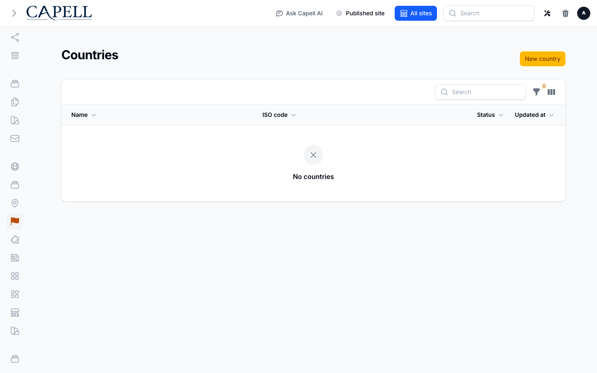
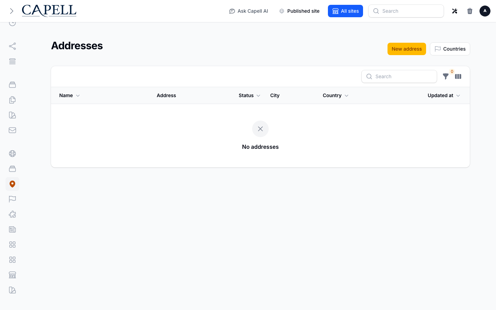

# Address

<!-- prettier-ignore-start -->

## What This Plugin Adds

Address is an **Available**, **Schema-owning** Capell package in the **Capell Foundation** product group. It ships as `capell-app/address` and extends these surfaces: admin.

Reusable countries and structured postal addresses for Capell: one shared address record, site-scoped, that any package can reference instead of re-modelling location fields.

After install, admins get package-owned management or reporting surfaces inside Capell.

Status details:

- Status: Available
- Tier: free
- Bundle: foundation
- Composer package: `capell-app/address`
- Namespace: `Capell\Address`
- Theme key: not applicable

## Why It Matters

**For developers:** The package gives developers package-owned service providers, Actions, Data objects, models, Filament classes, and Blade views instead of pushing this behaviour into core or application code.

**For teams:** Reusable countries and structured postal addresses for Capell: one shared address record, site-scoped, that any package can reference instead of re-modelling location fields.

## Screens And Workflow

Screenshot contract: `docs/screenshots.json`.

- Countries admin index (admin, required).
- Addresses admin index (admin, required).
- Create/edit country form (admin, optional).
- Create/edit address form (admin, optional).
- Site settings fields where address data is injected (admin, optional).

## Technical Shape

- Service providers: `Capell\Address\Providers\AddressServiceProvider`.
- Migrations: `packages/address/database/migrations/2026_05_10_190839_01_create_countries_table.php`, `packages/address/database/migrations/2026_05_10_190839_02_create_addresses_table.php`.
- Models: `Address`, `Country`.
- Filament classes: `AddressSelect`, `CountrySelect`, `FlagSelect`, `DefaultAddressConfigurator`, `DefaultCountryConfigurator`, `DefaultLanguageConfigurator`, `AddressResource`, `ManageAddresses`, `AddressForm`, `AddressesTable`, `CountryResource`, `ManageCountries`, `and 3 more`.
- Policies: `AbstractAddressResourcePolicy`, `AddressPolicy`, `CountryPolicy`.
- Actions: `BuildAddressQualityHealthReportAction`, `FindDuplicateAddressGroupsAction`, `GetAddressNameAction`, `GetAddressSelectRecordAction`, `GetCountryNameAction`, `ImportCountriesAction`, `InstallAddressPackageAction`, `ListAddressOptionsAction`, `ListCountryOptionsAction`, `NormalizeAddressGeocodingAction`.
- Data objects: `AddressGeocodingResultData`, `AddressMetaData`, `AddressQualityHealthReportData`, `AddressValidationResultData`, `DuplicateAddressGroupData`, `ImportCountriesResultData`, `NormalizeAddressGeocodingResultData`.
- Command signatures: `capell:address-countries-import`, `capell:address-demo`, `capell:address-faker`, `capell:address-geocode-normalize`, `capell:address-install`.
- Console command classes: `DemoCommand`, `FakerCommand`, `ImportCountriesCommand`, `InstallCommand`, `NormalizeAddressGeocodingCommand`.
- Manifest contributions: `admin-resource: Capell\Address\Manifest\AddressResourceContribution`, `admin-resource: Capell\Address\Manifest\CountryResourceContribution`, `asset: Capell\Address\Manifest\AddressAdminAssetsContribution`, `configurator: Capell\Address\Manifest\AddressConfiguratorsContribution`, `console-command: Capell\Address\Manifest\AddressConsoleCommandsContribution`, `health-check: Capell\Address\Health\AddressHealthCheck`, `migration: Capell\Address\Manifest\AddressMigrationsContribution`, `model: Capell\Address\Manifest\AddressModelsContribution`, `schema-extender: Capell\Address\Manifest\AddressSiteSchemaExtenderContribution`.
- Health checks: `Capell\Address\Health\AddressHealthCheck`.
- Blade views: `packages/address/resources/views/components/flag-icon.blade.php`.

## Data Model

- Required tables: `countries`, `addresses`.
- Models: `Address`, `Country`.
- Migration files: `2026_05_10_190839_01_create_countries_table.php`, `2026_05_10_190839_02_create_addresses_table.php`.
- Migration impact: run host migrations through the package install flow before opening package surfaces.
- Deletion/retention behaviour: Docs gap unless the package has an explicit pruning command, retention setting, or tested cascade path.

## Install Impact

- Admin navigation: adds package-owned Filament classes when registered.
- Permissions: none declared in `capell.json`.
- Public routes: none detected in package route files.
- Database changes: package migrations are declared.
- Settings: no package settings declared.
- Queues or schedules: none detected in standard package paths.
- Cache tags: none declared.
- Commands: `capell:address-countries-import`, `capell:address-demo`, `capell:address-faker`, `capell:address-geocode-normalize`, `capell:address-install`.

## Common Pitfalls

- Run migrations before opening package resources or public routes.
- Keep `composer.json`, `composer.local.json`, `capell.json`, docs, screenshots, and tests aligned when the package surface changes.

## Troubleshooting

| Symptom | Likely cause | Check | Fix |
| --- | --- | --- | --- |
| Package surface is missing after install | Provider or manifest is not loaded | Confirm `capell.json`, package `composer.json`, and provider registration | Reinstall the package, refresh Composer autoload, and clear host caches |
| Admin screen or command fails on missing table | Package migrations have not run | Check the tables listed in `Data Model` | Run host migrations and rerun the focused package test |
| Background work does not run | Queue worker or scheduled command is not active | Check package jobs, commands, and host scheduler configuration | Start the queue or scheduler, then run the focused command or package test |

## Quick Start

1. Install the package: `composer require capell-app/address`.
2. Run the required setup: `php artisan capell:address-install`.
3. Open the related Capell admin surface and verify Address appears.

## Next Steps

- [Package docs](docs/README.md)
- [Overview](docs/overview.md)
- [Screenshot contract](docs/screenshots.json)
- [Marketplace assets](docs/assets/marketplace/)
- [Capell content language plan](../../docs/CONTENT_LANGUAGE_PLAN.md)
- [Capell documentation design system](../../docs/DESIGN_SYSTEM.md)
- [Capell and package ERD notes](../../docs/erd/capell-and-package-erds.md)
- Related packages: [Bookings](../bookings/README.md), [Events](../events/README.md).
- Focused tests: `vendor/bin/pest packages/address/tests --configuration=phpunit.xml`.

<!-- prettier-ignore-end -->
