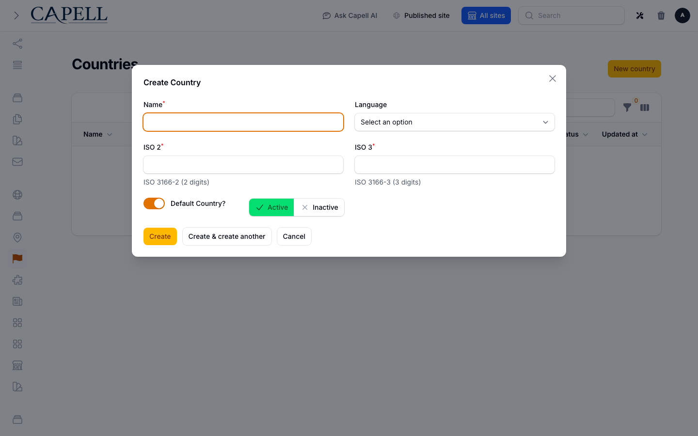
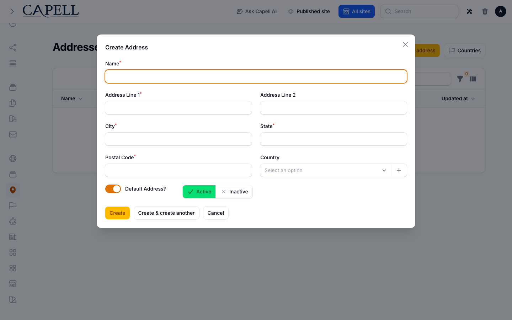
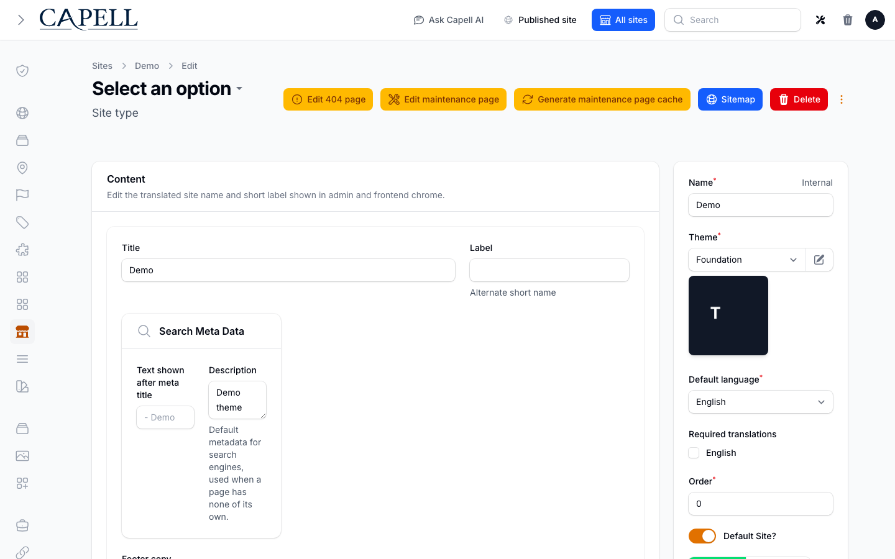

# Using Address

This guide is for admins who keep the shared list of countries and postal addresses tidy, so other parts of Capell can reuse them instead of re-typing the same location everywhere. No technical knowledge needed. Every step uses the labels you see on screen. Both screens live under the **Web Pages** group in the admin sidebar.

## Using Address (how-to)

### How to review available countries

1. Go to **Web Pages > Countries**.
2. The list shows each country with its **ISO code** and how many **Addresses** use it.
3. Check this before you rely on country and address pickers elsewhere, so the country you need is present.

### How to add or correct a country

1. Go to **Web Pages > Countries** and start a new country (or open an existing one to fix it).
2. Fill in the **Name**.
3. Enter the **ISO 2** and **ISO 3** codes for the country.
4. Save the country.

### How to review saved addresses

1. Go to **Web Pages > Addresses**.
2. The list shows each address with its **City**, **Postal code**, and **Country**.
3. Use this screen to find an address you have already saved, or to spot one that needs correcting.

### How to create a reusable address

1. Go to **Web Pages > Addresses** and start a new address.
2. Give it a **Name** so you can recognise it later.
3. Fill in **Address Line 1** and, if needed, **Address Line 2**.
4. Add the **City**, **State**, and **Postal Code**.
5. Choose the **Country** from the picker.
6. Save the address. It can now be selected anywhere that asks for an address.

### How to use a saved address in site settings

1. Open your site settings in the admin.
2. Find the address field and choose one of your saved addresses from the **Address** picker.
3. Save the settings. The site now uses that address. If you edit the selected address from the site picker later, the package may create a site-specific copy to avoid changing a shared or other site's address.

## Troubleshooting

| What you see                                     | What it means                          | What to do                                                                          |
| ------------------------------------------------ | -------------------------------------- | ----------------------------------------------------------------------------------- |
| The country I need is missing from a picker      | That country has not been added yet    | Go to **Web Pages > Countries** and add it with its **Name** and ISO codes          |
| The address picker is empty in site settings     | No addresses have been saved yet       | Go to **Web Pages > Addresses** and create one first                                |
| A country shows zero **Addresses**               | No saved address uses that country     | This is fine; the country is still available to pick when you add an address        |
| The address changed for one site but not another | The site picker created a site-specific copy to protect a shared or other site's address | Check the selected address on each site, then update the intended address record in **Web Pages > Addresses** |
